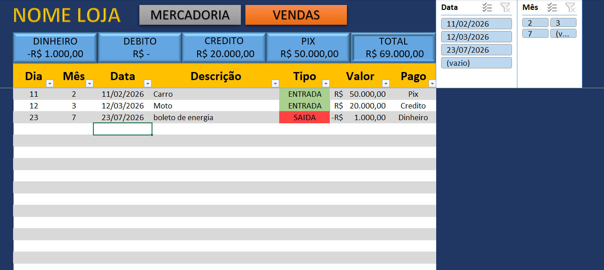
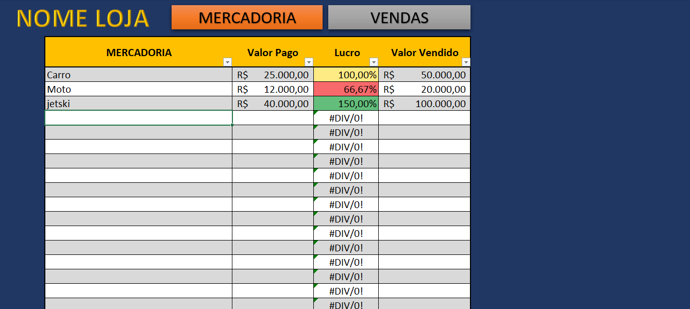

# Projeto: Sistema Integrado de Fluxo de Caixa e Análise de Viabilidade

## 📌 Sobre o Projeto
Este projeto apresenta uma solução completa para a gestão financeira, unindo o **controle operacional de caixa** com a **análise estratégica de viabilidade**. O sistema foi desenvolvido para permitir que o usuário não apenas registre as movimentações diárias (Entradas e Saídas), mas também utilize esses dados para calcular se um projeto ou investimento é financeiramente sustentável a longo prazo.

## 🚀 Módulos do Sistema

### 1. Gestão de Fluxo de Caixa (Operacional)
Focado no controle de liquidez e saúde financeira imediata:
* **Lançamentos Cronológicos:** Registro de receitas, custos e despesas com identificação de categorias.
* **Cálculo de Saldo Operacional:** Lógica automatizada para atualização de saldo acumulado.
* **Projeção de Caixa:** Ferramenta para antecipar períodos de déficit ou superávit com base em lançamentos futuros.

### 2. Análise de Viabilidade (Estratégico)
Utiliza os fluxos projetados para calcular indicadores de desempenho financeiro:
* **VPL (Valor Presente Líquido):** Demonstra a riqueza gerada pelo projeto trazida ao valor de hoje.
* **Payback Descontado:** Identifica o tempo exato necessário para recuperar o investimento inicial, considerando o valor do dinheiro no tempo.

[Image of a financial cash flow diagram showing inflows and outflows over time]

## 📊 Lógica e Fundamentação Matemática

O sistema integra as duas áreas através das seguintes fórmulas:

* **Saldo Final:** `Saldo Inicial + Entradas - Saídas`
* **Valor Presente (VP):** `VP = Fluxo de Caixa / (1 + i)^t`
* **VPL:** `VPL = Σ VP - Investimento Inicial`

*Onde **i** representa a Taxa Mínima de Atratividade (TMA) e **t** o período.*

## 🛠️ Tecnologias e Competências de ADS
Como desenvolvedor em formação, este projeto demonstra as seguintes habilidades técnicas:
* **Arquitetura de Dados:** Organização de tabelas para garantir a integridade dos registros financeiros.
* **Lógica de Programação:** Algoritmos complexos para automação de cálculos financeiros e projeções.
* **Excel Avançado & VBA:** Desenvolvimento de interface e motor de processamento de dados.
* **SQL:** Estruturação para armazenamento de históricos de movimentação (opcional).

### Visualização do Sistema

